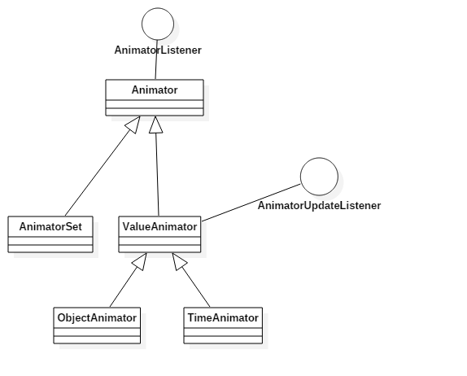
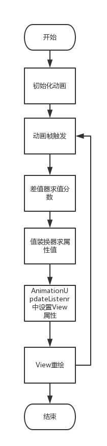
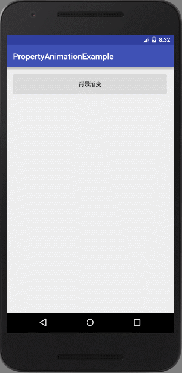
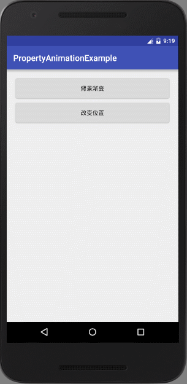

# Android动画基础——属性动画（Property Animation）
本篇讲android 3.0引入的属性动画框架，上篇写[视图动画View Animation](https://github.com/fallblank/AndroidView/tree/master/AboutAnimation/ViewAnimationExample)时就说过ViewAnimation的缺点，那就是动画作用的是view本身的视觉部分，view实际属性并没有随着动画的改变而变化。很多时候就需要额外去出来由于动画引起的事件不同步，比如ViewAnimation已经讲View移出了屏幕，但View的事件触发还在原地，这就需要额外处理了。
但是，PropertyAnimation的引入就完全解决了这个问题，它可以保证动画和事件的变化总是一起的发生的。其本质是View是属性变化带动View重绘来完成动画。
## 目录
- 属性动画框架结构
- 个人理解
- TypeEvaluator与Interpolators
- ObjectAnimator
- ValueAnimator
- 动画集： Keyframes于AnimatorSet

## 一、属性动画框架结构
个人觉得了解继承结构对学习框架帮助挺大的，所以开始先说一下属性动画的框架，我自己用StartUML画了下面的类图：

画得比较糙（StartUML用的不好，  \-\_\-!），上面没画出TypeEvaluator和Interpolator，一来是怕复杂了不好看重点信息，二来是后面会重点讲。大致讲一下各个类的作用：
- Animator类：属性动画框架的基类，封装了动画时间、监听器、动画状态的控制。
- AnimatorListener：动画状态接口，封装了不同状态需要调用的方法，有如下方法
  - onAnimationStart() - 动画开始时调用
  - onAnimationEnd() - 动画结束时调用
  - onAnimationRepeat() - 动画重复时调用
  - onAnimationCancel() - 动画取消时调用，注意这个方法调用后会接着调用onAnimationEnd()
- AnimatorSet：类似于视图动画中的AnimationSet，它代表了一个动画集，可以指定动画集中各个动画的顺序，是实现复杂动画必不可少的利器。
- ValueAnimation：属性动画的核心类，它能驱动View的属性变化进而实现动画。
- AnimationUpdateListenr：与ValueAnimation搭配使用，每次需要刷新动画帧时会调用这个接口里的方法，进而对真正的View设置属性完成动画。它就包含一个接口方法：
  - onAnimationUpdate()
- ObjectAnimator：ValueAnimator的便捷版本，也是平时使用最多的属性动画类，它通过反射调用自动完成View属性的设置，非常简单。
- TimeAnimator：可是用于同步动画的辅助类，可以在触发动画帧时通过接口让动画执行指定的时间点。

以上便是属性动画框架的大致结构，关于ypeEvaluator和Interpolator后面有讲到。
## 二、个人理解
1.属性动画时“真正的”动画机制吗？
我觉得不是（放下手头的砖，让我说完 ㄟ( ▔, ▔ )ㄏ），为什么我说不是？它并不是直接生成一段动画，它是通过在众多动画帧上改变View的属性，然后View重绘，进而达到动画的目的。或者把它理解成一个过渡值产生器更合适，它在每个动画帧时间点上产生一个过渡值，然后把这个值设为相应的属性。
2.属性动画VS视图动画：
属性动画相比于视图动画的优点是显而易见的，因为动画的来源是由于View的属性变化引起的重绘，所以不存在事件与动画不一致的情况。
视图动画最大的优点就是它简单了，不需要添加各种监听器就能实现动画。
我还没有两种动画性能的对比，不知道在实现相同效果时孰优孰劣，所以不敢妄下结论。留到后面讨论吧！
3.ValueAnimator VS ObjectAnimator
ObjectAnimator是ValueAnimator的便捷类，为了避免复杂的实现尽量选择用ObjectAnimator。
## 三、TypeEvaluator与Interpolators
前面多次说道动画帧（Frame），什么叫Frame呢？相当于视图动画中的帧动画，也就是每一个单独的页面，类似于胶卷电影中的一格。人眼的可察觉刷新频率是24帧每秒，在低于这个频率的动画中我们看到影像就不是连续的。而熟悉动画中用来指定动画刷新频率的是setFrameDelay()方法，默认情况下它的值是10ms，也就是100帧每秒。有了刷新频率，如何讲它映射到值呢？这就要用到TypeEvaluator和Interpolators了！
先说Interpolators（插值器）：它的总用是怎样将一个时间分数装换为一个值分数，两者的相对关系体现了动画的形式：匀速、加速、先加速后减速，或者其它的数学变换。怎么理解讲一个时间分数装换为值分数呢？来看一下接口吧！所以插值器都是TimeInterpolator接口的子类，其中声明的方法：
```Java
abstract float	getInterpolation(float input)
```
input是一个已经过去的时间占总时间的比例，也就是动画已经完成的百分比。返回的也是个小数，代表了希望这个点完成的总动画的百分数。假设有这样一个插值器，它接受0.5，返回0.8。这意味着这个差值器在经过50%的时间时，希望动画完成了80%。为什么是希望呢？因为真正映射为属性值是由TypeEvaluator来完成的。
TypeEvaluator：（翻译成类型求值器吧！这样比较贴合它的意思）它完成了差值器返回的值到实际值的映射？或许你会疑问为什么需要这个值，不应该是下面这个公式吗？
> startVal:起始值 endVal：结束值  percent：完成百分比  progress：当前值
> progress = startVal + (endVal-startVal)\*progress

对，的确是这样的。内置的IntEvator、floatEvator也是这样的，但是我们动画的类型不一定都是这种数值类型的值吧！我们还可以动画字符串，在不同的时间点显示不同的字串，这时上述公式就不成立了。所以TypeEvaluator就是为了达到自定义装换的需求的。要实现满足自己需求的TypeEvaluator也很简单，只需要实现TypeEvaluator接口就可以了，它声明的方法如：
```Java
abstract T	evaluate(float fraction, T startValue, T endValue)
```
T是要动画的属性类型，fraction是值分数，startValue、endValue是进行动画属性的起始值和终止值。返回映射的中间值。
到这，可以对属性动画的工作原理做个简单的接受了。
动画需要指定持续时间，属性起始值，属性终止值，帧延时。然后每过帧延时的时间间隔，触发插值器，接着触发值装换器，接下来是触发AnimationUpdateListenr中的onAnimationUpdate()方法重新设置View的属性，接着View重绘，如此循环知道动画结束。为了方便，我画了如下流程图：<br>
<br>
ps:这符图不是很严谨，因为有些内容是不好表达，比如动画帧的计时是连续的，并不是等到上一帧完成了才开始计数下一帧。其次就是Animator本身的Listener是班法画上去的，当Animator调用cance(),end()之类的方法是能打断这个流程的。但是这图对理解过程还是不错的。
## 四、ObjectAnimator
先来讲最常使用的属性动画，ObejectAnimator，通过置顶好动画作用对象个对用属性等设置值后，ObjectAnimator能够通过反射区设置对象属性达到动画的目的。
ObjectAnimator提供了四种静态方法来构造自己的对象，分别是：ofInt、ofFloat、ofArgb、ofObject
。它们动画的值类型正如名字中说的那样，如ofInt动画作用于一个int域，offArgb注意与一个带透明的颜色域。
来看一个用动画改变栏背景的例子
```Java
public class MainActivity extends AppCompatActivity {

    @Bind(R.id.btn_bg) Button mGradientBg;
    ObjectAnimator mAnimator;

    @TargetApi(Build.VERSION_CODES.LOLLIPOP) @Override
    protected void onCreate(Bundle savedInstanceState) {
        super.onCreate(savedInstanceState);
        setContentView(R.layout.activity_main);
        final View view = findViewById(android.R.id.content);
        final Drawable bgd =view.getBackground();
        mAnimator = ObjectAnimator.ofArgb(view,"backgroundColor",0x881DDA38,0x88D48AB2);
        mAnimator.setDuration(5*1000);
        mAnimator.setRepeatMode(ObjectAnimator.REVERSE);
        mAnimator.addListener(new AnimatorListenerAdapter() {
            @Override public void onAnimationEnd(Animator animation) {
                super.onAnimationEnd(animation);
                view.setBackground(bgd);
            }
        });
        ButterKnife.bind(this);
    }


    @OnClick(R.id.btn_bg) void onGradientActionbarClicked() {
        mAnimator.start();
    }
}
```
效果如下：<br>
<br>
上面就是ObjectAnimation使用过程，先通过四个静态方法构造出一个ObjectAnimation对象，这里使用的是ofArgb：
```Java
static ObjectAnimator	ofArgb(Object target, String propertyName, int... values)
```
- 第一个是作用的对象
- 第二个是string指定的属性名
- 第三个可变参数是动画的起始值（可省略，省略以当前值算，且必须有getter）、终止值。

ObjectAnimator作用的域在对象是必须有相应的setter，getter（用于省略初始值的情况）方法，否则反射调用不了会报错。至于没有setter方法的域如何动画，官方Guide提供了如下解决方案：
- 使用包装类，加入setter，getter。
- 添加相应方法（自己定义View适合）
- 换用ValueAnimator。

讲一下使用包装类，假设有类A，且A类中有域a，我可以正常操作A.a(访问和写值)，现在我要动画A的a域，直接用ObjectAnimator是不行了，因为A类中没有A.setA()这个方法，那该怎么办呢？使用包装类，写一个A的包装类AWrapper，它接受一个A对象来构造自己，然后里面有一个setter和getter方法来设置和读取A的a域。现在就可以在AWrapper上使用ObjectAnimator了。
## 六、ValueAnimator
ValueAnimator提供的便利性大大强于ObejectAnimator，因为需要你自己去更新对象的值，ValueAnimator只是为了提供了一个过渡值。为了更新对象的值，你就必须去设置前面讲的AnimationUpdateListenr接口。一个简单的例子来完成ValueAnimator的使用：
```Java
protected void onCreate(Bundle savedInstanceState) {
       super.onCreate(savedInstanceState);
       setContentView(R.layout.activity_main);
       ButterKnife.bind(this);
       final float X = 0, Y = 500;
       LogUtil.d("X,Y = "+X+","+Y);
       mValueAnimator = ValueAnimator.ofFloat(0f, 1f);
       mValueAnimator.setDuration(3 * 1000);
       mValueAnimator.addUpdateListener(new ValueAnimator.AnimatorUpdateListener() {
           @Override public void onAnimationUpdate(ValueAnimator animation) {
               mChangelocation.setY(Y * (Float)animation.getAnimatedValue());
               mChangelocation.invalidate();
           }
       });
       mValueAnimator.addListener(new AnimatorListenerAdapter() {
           @Override public void onAnimationEnd(Animator animation) {
               super.onAnimationEnd(animation);
               mChangelocation.setY(Y);
           }
       });
  }
  @OnClick(R.id.btn_cl) void onChangeLocationClicked() {
        mValueAnimator.start();
    }
}
```
效果：<br>
<br>

## 七、动画集： Keyframes于AnimatorSet
类似于ViewAnimation中的动画集，参考资料：[AnimatorSet](https://developer.android.com/guide/topics/graphics/prop-animation.html#choreography)<br>
Keyframes实现动画集：[Keyframes](https://developer.android.com/guide/topics/graphics/prop-animation.html#keyframes)
