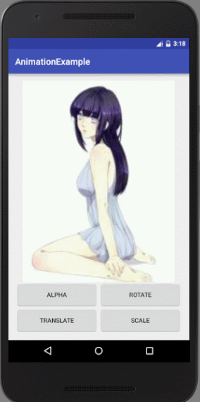
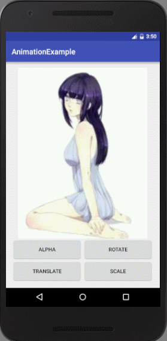
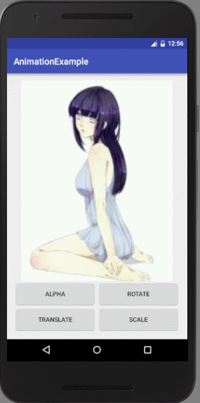
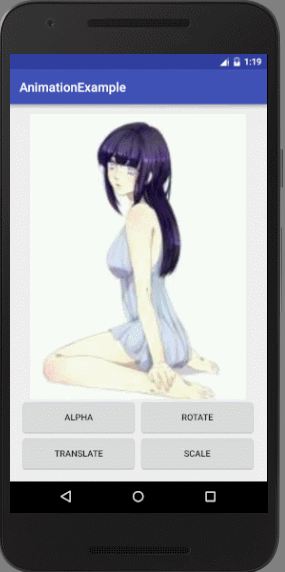
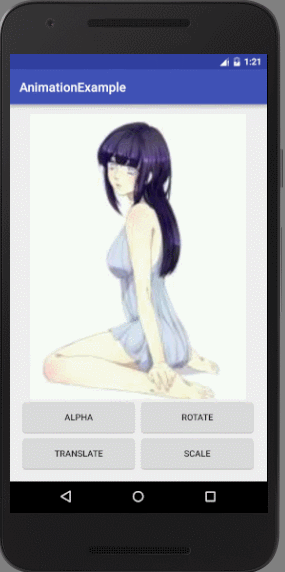
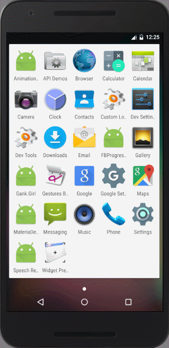

# Android 动画基础——视图动画（View Animation）
本篇讲android 3.0之前被广泛的动画框架——ViewAnimation。<br>

## 目录
我将分为六部分来讲：<br>
- 概述
- Alpha透明动画
- Rotate旋转动画
- Translate位移动画
- Scale放缩动画
- 最佳实践：带动画SplashScreen的实现
- 简单总结

第一部分讲讲视图动画的特点，接着的四部分讲具体的视图动画类型，再接着的一部分通过一个例子来说明视图动画的运用，最后简单总结一下<br>

## 一、概述
其实叫“概述”有点名不符实，我只是想讲讲视图动画的特点，简单的扯两句实现原理，如何运用。除此再无其他！（友情提醒：可以只看加粗部分）<br>

1.视图动画实现原理：
用一句话说明就是android通过矩阵运算来实现视图动画。
包含动画的View的ViewGroup在调用drawChild时会获取到动画的Tansformation值，然后调用canvas.concat(tansformationToApply.getMatrix()),进而矩阵运算等到动画效果。
**大概过程就是在规定的时间里不断的进行矩阵计算，然后invalidate()。**<br><br>
2.ViewAnimation的最大特（缺）点：
**动画过程对View的交互不造成任何影响**,这里所说的影响是做动画的View的事件触发区域不会随着动画而改变，会造成View已经不再原来的位置了，但该位置还能触发相应的动作。这点就很反人类了，所以要特别注意。如果要想事件区域也发生变化，那就考虑用属性动画吧！<br>
3.属性动画集
有时单一的视图动画不能满足要求（实际上都不能满足），那就可以考虑用多个属性动画组成动画集，来完成想要的效果。这点会在最后一部分讲到。<br>
4.项目源码：[Github](https://github.com/fallblank/AndroidView)<br>
5.(想起再补充吧！ ㄟ( ▔, ▔ )ㄏ)

## 二、Alpha透明动画
关于什么是Alpha就不赘述了。简单说一下Alpha动画的效果，就是View从透明到不透明或者相反的过程。（无图言diao， (╯▽╰)，请看下面的动画）<br>
<br>
下面我们来说说如何实现gif中的效果，直接给出代码：
```Java
    /**
     * 触发Alpha（透明）动画
     */
    @OnClick(R.id.btn_alpha) void onAlphaClicked() {
        AlphaAnimation alpha = new AlphaAnimation(0, 1);
        alpha.setDuration(2000);
        mStage.startAnimation(alpha);
    }
```
上面代码创建了一个Alpha动画，设置的效果是从完全透明到完全不透明，整个动画持续2秒，并指定了由mStage（这个例子中是ImageView）来完成动画。<br><br>
关于AlphaAnimation，它有两个构造方法：
```Java
AlphaAnimation (Context context, AttributeSet attrs)
AlphaAnimation (float fromAlpha, float toAlpha)
```
第一个是从xml加载动画设置，视图动画都有这个构造方法，关于这部分后面再慢慢写。<br>
第二个构造方法接受两个单精度浮点，第一个指定起始的alpha值，第二个终止的alph值。整个动画就是从起始alpha值到终止alpha值的变化过程。
<br>
**关于动画的其他设置：**
视图动画族都是继承自	android.view.animation.Animation，其中抽象父类Animation定义了动画的全部操作集。每个子类基本没有新增方法，所以一切就变得简单了。（妈妈在也不用担心我记那么多api了 o(\*≧▽≦)ツ）<br>
developer文档：[Animation操作集](https://developer.android.com/reference/android/view/animation/Animation.html)<br>
常用设置：<br>
- getDuration()
返回动画持续时间
- cancel()
取消一个动画
-	hasEnded()
判断动画是否结束
- hasStarted()
判断动画是否开始
- initialize(int width, int height, int parentWidth, int parentHeight)
同指定的尺寸去初始化动画的View和其ViewGroup，这个方法在四种视图动画中都有重写版本。
-	setRepeatMode(int repeatMode)
设置动画结束后是否重复
-	setStartTime(long startTimeMillis)
多少时间后启动动画
- reset()
重置动画
- ...


这部分其实是视图动画的公共部分，其他类型的视图动画也一样。

## 三、Rotate旋转动画
旋转动画的效果是这样的：<br>
<br>
代码还是很简单：
```Java
    /**
     * 触发Rotate（旋转动画）
     */
    @OnClick(R.id.btn_rotate) void onRotateClicked() {
        RotateAnimation rotate = new RotateAnimation(0, 360, Animation.RELATIVE_TO_SELF, 0.5f,
            Animation.RELATIVE_TO_SELF, 0.5f);
        rotate.setDuration(2000);
        mStage.startAnimation(rotate);
    }
```
相比于alpha动画，rotate旋转动画的构造就显得复杂多了，下面给出它的构造方法集：
```Java
RotateAnimation(Context context, AttributeSet attrs)

RotateAnimation(float fromDegrees, float toDegrees)

RotateAnimation(float fromDegrees, float toDegrees, float pivotX,float pivotY)

RotateAnimation(float fromDegrees, float toDegrees, int pivotXType, float pivotXValue, int pivotYType, float pivotYValue)
```
在讲各个构造方法的区别前，先讲讲旋转操作需要具备什么条件才能进行。<br>
- 角度<br>
从哪个角度开始，到哪个角度结束，所以角度是必备条件。
- 旋转中心<br>
旋转在成的效果是View按照某个定点旋转一定角度。<br>

所以旋转动画的参数起始就是为了指定这两个条件。<br>
- RotateAnimation(Context context, AttributeSet attrs)<br>
第一个构造方法不多说了,它从xml加载旋转动画，所有需要的值都在xml定义好了的。
- RotateAnimation(float fromDegrees, float toDegrees)<br>
起始角度和终止角度有两个参数决定，那定点呢？默认定点为View的起始点（0,0）也就是左上角。
- RotateAnimation(float fromDegrees, float toDegrees, float pivotX,float pivotY)<br>
在第二个构造方法的基础上加入了对旋转中心坐标的指定。
- RotateAnimation(float fromDegrees, float toDegrees, int pivotXType, float pivotXValue, int pivotYType, float pivotYValue)<br>
这才是要讲的重点，（什么鬼！多出来的2个参数是什么？ (ノಠ益ಠ)ノ彡┻━┻，不急不急，摆好 ┬—┬ノ('-'ノ)，听我慢慢说），多出来的两个参数大大减少了我们的计算。它们是一组标志，取值为：ABSOLUTE、RELATIVE_TO_PARENT、RELATIVE_TO_SELF中的一个，分别表示指定的坐标是绝对坐标，相对于父控件坐标，相对于自己的坐标。怎么理解呢？绝对值就是你写多少就是多少，类似于方法二中的坐标。相对于父控件就是指定的值乘以父控件的对于值（宽、高）得到的坐标。相对于自己同理，只是变成乘以自己的宽高了。比如上面我写的例子里就是值自己的几何中心为旋转中心。（是不是减少了好多计算？！ (＾－＾)V）<br>

关于旋转动画，还想说明的是旋转的方向问题：<br>
- 当fromDegrees \> toDegrees  旋转方向为顺时针
- 当fromDegrees < toDegrees 旋转方向为逆时针<br>

其他设置同上面alpha中讲的一样。

## 四、Translate位移动画
位移动画的效果如下：<br>
<br>
代码实现：<br>
```Java
 /**
     * 触发Translate（位移）动画
     */
    @OnClick(R.id.btn_translate) void onTranslateClicked() {
        TranslateAnimation translate = new TranslateAnimation(Animation.RELATIVE_TO_SELF, 0f,
            Animation.RELATIVE_TO_SELF, 1f, Animation.RELATIVE_TO_SELF, 0f,
            Animation.RELATIVE_TO_SELF, 1f);
        translate.setDuration(2000);
        mStage.startAnimation(translate);
    }
```
位移动画的构造方法如下：
```Java
TranslateAnimation(Context context, AttributeSet attrs)

TranslateAnimation(float fromXDelta, float toXDelta, float fromYDelta, float toYDelta

TranslateAnimation(int fromXType, float fromXValue, int toXType, float toXValue, int fromYType, float fromYValue, int toYType, float toYValue)
```
同样的，我们先讨论位移动画需要哪些条件：
- 起点<br>
- 终点

因为位移就是做直线运动，有起点终点就行了。
那么构造函数参数的意义就很明显了，就不叨叨了。

## 五、Scale缩放动画
缩放动画要达到以下效果：
<br>
缩放动画的实现代码如下:
```Java
    /**
     * 触发Scale（缩放）动画
     */
    @OnClick(R.id.btn_scale) void onScaleClicked(){
        ScaleAnimation scale = new ScaleAnimation(0,1,0,1,Animation.RELATIVE_TO_SELF,0.5f,Animation.RELATIVE_TO_SELF,0.5f);
        scale.setDuration(2000);
        mStage.startAnimation(scale);
    }
```
还是一样讲构造函数：
```Java
ScaleAnimation(Context context, AttributeSet attrs)

ScaleAnimation(float fromX, float toX, float fromY, float toY)

ScaleAnimation(float fromX, float toX, float fromY, float toY, float pivotX, float pivotY)

ScaleAnimation(float fromX, float toX, float fromY, float toY, int pivotXType, float pivotXValue, int pivotYType, float pivotYValue)
```
放缩是一个比例变换的过程，构建一个放缩动画第一项需要指定放缩比例，所以fromX、toX、fromY、toY就是用来指定放缩的比例的。比如：
>fromX = 0f;
toX=1f;
fromY=0f;
toY=1f;

就是上面gif中的效果，从无都原大小的动画。
缩放动画第二个需要指定的就是缩放中心，默认缩放中心为（0,0）。上面的gif指定的放缩中心为View的几何中心。下面来看几个不是几何中心的例子：
- 默认旋转中心(0,0)：ScaleAnimation(0,1,0,1)<br>

- 指定旋转中心(500,0)：TranslateAnimation(0,1,0,1,500,0)<br>


其它设置同上。

## 六、最佳实践：带动画SplashScreen的实现
扯了这么多基础，下面我用一个例子来串起来之前的所以内容。我将用ViewAnimation实现一个应用启动屏（SplashScreen），类似与知乎日报的SplashScreen，它能逐渐放大和变淡。<br>
**1.什么是SplashScreen？为什么要有SplashScreen？**
SplashScreen是全屏（一般是这样的）的用来在应用启动时展示的信息。比如QQ、微博、微信都有自己的SplashScreen。微信启动时那张蓝色地球图就是一个SplashScreen。<br>
SplashScreen存在的原因我认为有（不一定正确）：
- 加载全局设置
- 展示重要信息，诱导用户点击
- 高（zhuang）大（bi）上（ (⊙﹏⊙)b）

在SplashScreen展示期间可以进行应用设置的加载，必要的网络数据请求等，这些操作比较费时，但有时应用启动的关键，不能让用户傻傻的看着你加载时期白屏，所以弄个SplashScreen出来转移用户注意力。达到更好的体验效果。<br>
**2.SplashScreen实现原理**<br>
SplashScreen有两种常见的实现方式：
- 使用一个view实现，然后在显示完成后gone掉。
- 使用独立的Activity来实现，然后在显示完成后启动别的activity，并finish掉SplashActivity。

**3.SplashScreen样例的实现**
在这，我选用第二种实现方式，先来效果图：<br>
<br>
这个Example中没有实际SplashScreenn期间干的事（加载设置之类的）我就是简单实现了效果。整个启动屏的效果就是先显示图片一秒钟，然后同时开始做alpha和scale动画，最后进入主界面。<br>
1）布局：<br>
布局很简单就是一个全屏的ImageView，就不多说了。<br>
2)代码：<br>
```Java
@Override protected void onCreate(@Nullable Bundle savedInstanceState) {
        super.onCreate(savedInstanceState);
        //设置全屏
        requestWindowFeature(Window.FEATURE_NO_TITLE);
        getWindow().setFlags(WindowManager.LayoutParams.FLAG_FULLSCREEN,
            WindowManager.LayoutParams.FLAG_FULLSCREEN);

        setContentView(R.layout.activity_splash);

        ActionBar actionBar = getSupportActionBar();
        if (actionBar != null) {
            actionBar.hide();
        }

        ButterKnife.bind(this);
        mHandler = new Handler();
        //让图片显示一秒钟，然后开始动画
        mHandler.postDelayed(new Runnable() {
            @Override public void run() {
                //使用动画集，让多个动画同时启动
                AnimationSet animationSet = new AnimationSet(true);
                animationSet.setDuration(2000);
                AlphaAnimation alpha = new AlphaAnimation(1, 0);
                alpha.setDuration(2000);
                animationSet.addAnimation(alpha);
                ScaleAnimation scale = new ScaleAnimation(1, 2, 1, 2, Animation.RELATIVE_TO_SELF,
                    0.5f,
                    Animation.RELATIVE_TO_SELF, 0.5f);
                scale.setDuration(2000);
                animationSet.addAnimation(scale);
                mSplash.startAnimation(animationSet);
            }
        }, 2000);
        //多少时间后启动主activity
        mHandler.postDelayed(new Runnable() {
            @Override public void run() {
                Intent intent = new Intent(SplashActivity.this, MainActivity.class);
                //在新的应用栈中启动activity
                intent.setFlags(Intent.FLAG_ACTIVITY_NEW_TASK);
                startActivity(intent);
                //销毁这个开始屏幕，这个很重要不然按下返回键会回退到启动屏
                SplashActivity.this.finish();
            }
        }, 3800);
    }
```
关于上述代码，需要说明3点：
* 全屏的设置除了设置窗口flag外，还需要讲actionbar给隐藏掉，设置窗口标志后只是没有了状态栏，但actionbar还在。
* 第二个postDelayed方法的时间需要小于图片停留时间后动画时间的总和，不然会后短暂的图片还原状态。这很好理解，代码执行时需要时间的，并不能不保证直接就触发finish操作。
* intent设置一个为FLAG\_ACTIVITY\_NEW\_TASK的flag会使得新启动的activity在一个新的应用栈中。<br>

你可以在[我的Github](https://github.com/fallblank/AndroidView)里找到本篇的全部例子代码。<br>

## 七、简单总结
至此全部关于ViewAnimation的内容算是讲完了，视图动画很简单，它只是作用于View的外观，并不会改变view的属性，也不会改变交互，这点需要特别注意。有序的组合各种视图动画也是能完成大部分的动画需求的，需要的解决动画间的配合。<br>

**tips：个人学习心得，可能有偏颇之处，如有错误，欢迎提交issue或指出！谢谢！**
