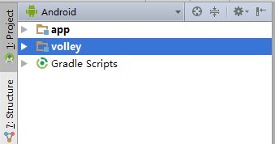
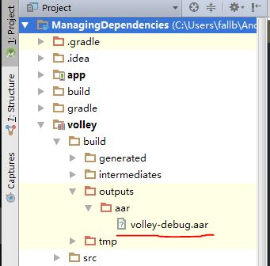
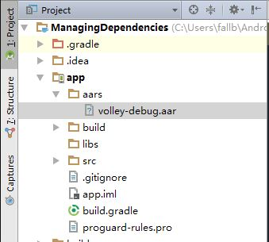

# AndroidStudio下的依赖管理
在开发中用第三方库是很常见的事，如何在AndroidStudio下管理这些依赖呢？这就是这篇文章的目的。
## 目录
- Maven/Ivy仓库依赖
- Module依赖
- aar文件依赖
- jar文件依赖
- 例子完整代码

## 一、Maven/Ivy仓库依赖
这中依赖在AndroidStudio中应用最广泛，也是相比于Eclipse+ADT开发来说的闪光点之一。先给出一个例子：
```Java
dependencies {
  //省略了一下默认配置
    compile 'com.android.support:appcompat-v7:23.4.0'
    compile 'com.jakewharton:butterknife:7.0.1'
  //其他依赖项
}
```
上面就是一个Maven仓库依赖的例子，项目依赖于兼容包和jakewharton大大的‘黄油刀’，为了突出重点省略了其他类型的依赖项（后面会讲到）。
### 1）配置仓库
（这段这是基础概念，可以选择略过）在配置Maven依赖之前我们得明白一下什么是仓库（repositories）和如何配置仓库，那什么是仓库呢？仓库说白了就是存放代码的地方，它能很好的进行版本控制和访问。应用广泛的仓库类型有两种：Ivy和Maven，Ivy在以Ant为构建的系统中应用比较广；相比于Ivy，Maven仓库就比较出名了。现在为广大程序员所知的Maven仓库有Jcenter和Maven Central，它们都是Maven仓库的实现。而这两种类型的仓库在以Gradle为构建工具的AndroidStudio中都能使用，且使用很简单，只需要在相应的配置文件中添加几行代码就行。
#### a.配置Maven仓库
这AndroidStudio下新建的项目，在项目根目录下的build.gradle里又这样一段代码：
```Java
allprojects {
    repositories {
        jcenter()
    }
}
```
这指定了所有module（包括appilcation module和library module，关于module的概念后面会将到）的默认仓库是Jcenter。这就有疑问了，同样是maven仓库为什么AndroidStudio默认指定不是Maven Central呢？Jcenter和Maven Central都是maven库没错，但是Jcenter是Maven Central的超集，也就是说你能在Maven Central中找到的依赖在Jcenter中也能找到，反之则不然。如果你非要用Maven Central也行，只要把  jcenter()  换成  mavenCentral()就行，但不建议在项目的build.gradle中修改，而是去你的module中修改，这样就能将影响范围控制到单个module。
#### b.导入依赖
配置好仓库后就可以导入依赖了，同样建议到module的build.gradle文件中导入需要的依赖库，而不是在项目的build.gradle中导入。讲要导入的仓库写进dependencies代码块内就行，类似于开篇的例子。
说说仓库是如何区分不同的库已经同一库的不同版本的，主要通过三个元素来区分：组别：库名：版本号
- 组名：一般表明了库的开发者，常用倒置的域名来表示，如com.jakewharton
- 库名：说明了这个库的名称，如butterknife
- 版本号：库的版本号

这三者用:分隔，一起组成了库的唯一标识，所以我们导入库依赖的格式就是：
 compile '组名：库名：版本号'
 起始不一定得是compile，也可能是provided、apk、testCompile，androidTestCompile，它们说明了把库加到那部分编译中去，具体是什么，自己google。

 #### c.动态版本导入
 什么叫动态版本导入呢？就是让Gradle去给你下载最新的库，而不是每次都是自己修改版本号。如下
 ```Java
 dependencies {
   compile 'com.android.support:support-v4:22.2.+'
   compile 'com.android.support:appcompat-v7:22.2+'
   compile 'com.android.support:recyclerview-v7:+'
}
```
这里面涉及到版本号的命名规则：主版本号.次版本号.debug版本号，不同版本号什么意思也自己google。解释一下上面三个依赖的意思：
- 要求是最新的debug版本
- 要求次版本至少大于2
- 最新的库

### 2）其他Maven/Ivy仓库的配置
非Jcenter和Maven Central仓库怎么maven仓库怎么配置？Ivy怎么配置？如下：
```Java
repositories {
  maven {
    url "http://baidu.com"//这里填写仓库地址
    credentials {         //这里填认证信息
      username 'user'
      password 'secretpassword'
    }  
  }
}
```
Ivy配置类似，只要把maven改成ivy就行了，再次申明为了将影响范围保持到最小，要将这项配置写到module的build.gradle文件中。

## 二、Module依赖
在AndroidStudio上，一个应用是由一个或多个Module组成，其中一个application module，零个或多个library module。application module最后可以打包成apk，library module就是每打包的库，它最后可以打包成jar或者aar（两者区别自己google）。这一节我们来讲讲如何导入自己或者别人写的module，下一节讲如何导入打包好的aar。
完成module依赖只需要完成三步：
- 拷贝库到项目的根目录下，和app module同级
- 在项目的setting,gradle中加入module名。如下
```Java
  include ':app', ':volley'
```
经过这个步骤，就就可以在项目导航的Android视图下看到导入的项目了<br>
<br>
其中app是Android生成的application module，volley是我导入的library module。但这只是告诉了Gradle去管理者两个module，并不能再app中应用volley中的API，需要完成下面一个步骤才能使用。
- 添加dependencies声明
```Java
dependencies {
    //为了突出重点，省略其他
    compile project(':volley')
}
```
这样一来导入module就成功了。
最后再说一下，如何在Android Studio中新建application module 和 library。File->new->new module 在弹出的对话框中选择module类型，module的类型起始是根据它的build.gradle中的插件类型决定的。
application module：
```Java
apply plugin: 'com.android.application'
```
library module:
```Java
 apply plugin: 'com.android.library'
 ```

## 三、arr文件依赖
arr文件是打包好的library module，在说明如何将aar文件引入到项目中，先说说如何打包module生成aar文件,Build->Make Module (module name)等Gradle构件完成后，会在下图所示的路径中生成aar文件<br>
<br>
开始讲如何将aar文件加入到项目中,同样需要三个步骤：
- 拷贝aar文件到module目录下，可以拷贝到libs文件中，或者任何新建的文件夹中<br>
<br>
我这里新建了一个叫aars的文件夹，然后把之前生成的aar文件放了进去
- 添加文件仓库
在module的build.gradle中添加代码块
```Java
repositories{
    flatDir{
        dirs 'aars'
    }
}
```
- 添加依赖
```Java
dependencies {
    //忽略其他
    compile(name:'volley-debug', ext:'aar')
}
```
至此添加aar文件依赖完成。

## 四、jar文件依赖
Android Studo文件依赖很简单，把jar包往libs文件里一放就ok了。这得益于AndroidStudio的默认配置：
```Java
 compile fileTree(dir: 'libs', include: ['*.jar'])
 ```
 这句话就是将libs目录下所有的jar包一次全倒过来。如果换成compile file(jar文件路径)可以一次只导入一个jar包。

# 五、例子完整代码
[Github-fallblank](https://github.com/fallblank)
